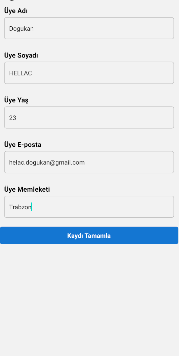

# Tarif Uygulaması

Bu proje, patika dev platformunda React Native kurs ödevidir

## Özellikler

- Kullanıcı girişi yapma

### Adımlar

   ```
   git clone https://github.com/Dogukan-Hellac/PatikaFitnessApp.git
   cd TodoApp
   npx expo start
   ```

## Ekran Görüntüleri

Uygulamanın nasıl göründüğünü ve çalıştığını görmek için aşağıdaki ekran görüntülerine göz atabilirsiniz:



